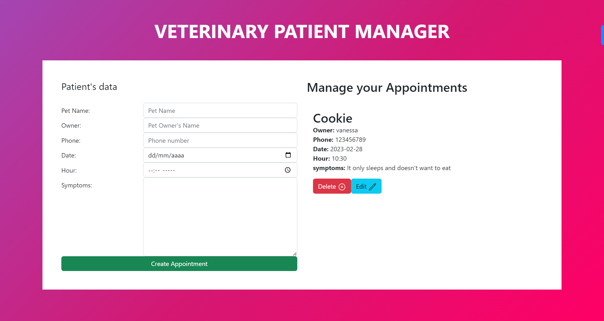

# vet-appointments
This project allows you to make appointments for your pet with the vet. Verify that your form is filled out correctly, and once your appointment has been added, you can edit or delete it.

## Built With

- HTML 🏗️
- CSS🖌️
- JavaScript 🤖
- Webpack 📦

## Live Demo

[Live Demo](https://vvoo21.github.io/vet-appointments/dist/)

### Screenshot

## Getting Started

To get a local copy up and running follow these simple example steps.

### Prerequisites
- Have a source code editor such as VSCode
- Install nodeJS along with NPM

### Setup
- Clone this repository into your local environment with `git clone https://github.com/vvoo21/vet-appointments.git`

### Install
- Just run `npm i` on the root of the project and you're good to go. All of the necesary packages will be installed for you!

### Run tests
- Run `npm run start` to se a live version of the project on your browser
- Run `npx hint .` to get Webhint going, a linter for HTML
- Run `npx stylelint --fix "**/*.{css,scss}"` to get Stylelint going, a linter for CSS
- Run `npx eslint --fix .` to get ESLint going, a linter for JS

### Deployment
- Run `npm run build` for Webpack to generate the dist files corresponding to your actual /src files

## Author

👤 **Vanessa Oliveros Padron**

- GitHub: [@vvoo21](https://github.com/vvoo21)
- Twitter: [@vaneoliverosp](https://twitter.com/vaneoliverosp)
- LinkedIn: [vaneoliverosp](https://www.linkedin.com/in/vaneoliverosp/)

## 🤝 Contributing

Contributions, issues, and feature requests are welcome!

Feel free to check the [issues page](../../issues/).

## Show your support

Give a ⭐️ if you like this project!

## Acknowledgments

- Hat tip to the Microverse program!
- Hat tip to anyone whose code was used!

## 📝 License

This project is [MIT](./LICENSE) licensed.
